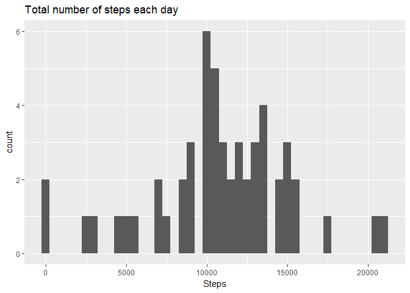
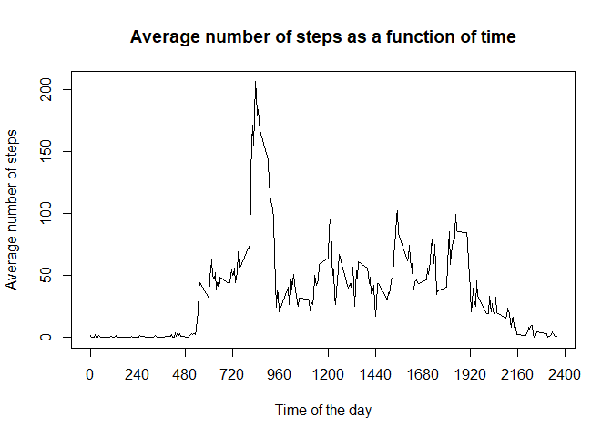
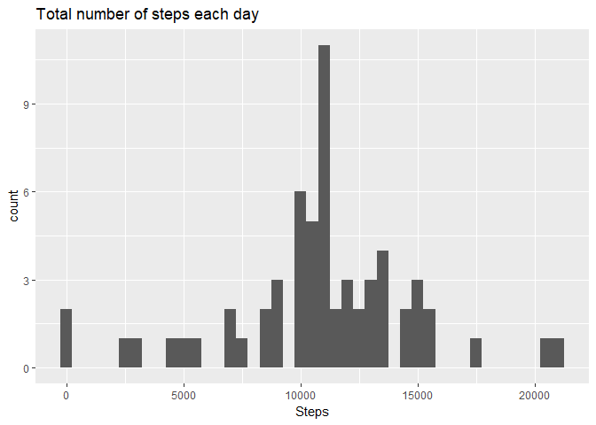
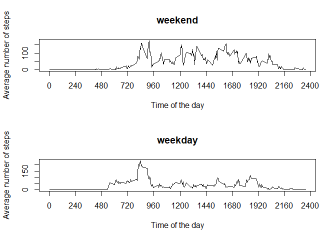

## Clean the environment and download and unzip the required data
1. Start by clearing all the variables and load the required libraries

```r
rm(list=ls())
library(ggplot2)
```

## Loading and preprocessing the data
1. Load the data

```r
unzip("activity.zip", exdir=".")
data <- read.csv("activity.csv", header=TRUE, stringsAsFactors=F)
```
2. Process the data

```r
data$date <- as.Date(data$date,format="%Y-%m-%d")
```

## What is the mean total number of steps taken per day?
1. Calculate the total number of steps taken per day

```r
stepsPerDate <- aggregate(steps ~ date, data=data, FUN=sum)
```
2. Make a histogram of the total number of steps each day  

```r
qplot(stepsPerDate$steps, 
      main = "Total number of steps each day", 
      xlab = "Steps", 
      binwidth = 500)
```

<!-- -->
  
3. Calculate the mean and median total number of steps per day  

```r
stepsPerDayMean <- mean(stepsPerDate$steps)
stepsPerDayMedian <- median(stepsPerDate$steps)
```
The average number of steps per day is 1.0766189\times 10^{4} and the median is 10765

## What is the average daily activity pattern?
1. Make a time series plot of the 5-minute interval (x-axis) and the average number of steps taken averaged across all days (y-axis)

```r
stepsPerInterval <- aggregate(steps ~ interval, data=data, FUN=mean)
plot(stepsPerInterval, type="l", main="Average number of steps as a function of time", xlab = "Time of the day", ylab = "Average number of steps", xaxt="n") 
axis(side = 1, at = seq(from=0,to=2400,by=240))
```

<!-- -->
  
2. Which 5-minute interval, on average across all the days in the dataset, contains the maximum number of steps?

```r
invervalOfMaxSteps <- stepsPerInterval$interval[which.max(stepsPerInterval$steps)]
```
The inverval that contains the maximum number of steps averaged over all the days in the dataset is 835 to 840 


## Inputing missing values
1. Calculate and report the total number of missing values in the dataset

```r
missingValuesNB <- sum(is.na(data))
```
The number of entries with NA's is 2304

```r
missingValuesPerc <- sum(is.na(data))/nrow(data)*100
```
The entries with missing values represent around 13.1% of the available data

2. Devise a strategy for filling in all the missing values in the dataset  
We will use the mean for that 5-minute interval. Can later improve by switching to that 5-minute interval on the same day of the week, or next nearest neighbour, etc...

3. Create a new dataset that is equal to the original dataset but with the missing data filled in
Merge the original dataframe with the one containing the number of steps per interval

```r
temp  <- merge(data, stepsPerInterval, by="interval", suffixes=c("",".y"))
NAs <- is.na(temp$steps)
temp$steps[NAs] <- temp$steps.y[NAs]
dataFilled <- temp[,c(1:3)]
```

4. Make a histogram of the total number of steps taken each day and calculate and report the mean and median number of steps taken per day. Do these values differ from the estimates from the first part of the assignment? What is the impact of inputing data on the estimates of the total daily number of steps ?
Plot the histogram

```r
stepsPerDateFilled <- aggregate(steps ~ date, data=dataFilled, FUN=sum)
qplot(stepsPerDateFilled$steps, 
      main = "Total number of steps each day", 
      xlab = "Steps", 
      binwidth = 500)
```

<!-- -->
Calculate the mean and median number of steps taken per day

```r
stepsPerDayFilledMean <- mean(stepsPerDateFilled$steps)
stepsPerDayFilledMedian <- median(stepsPerDateFilled$steps)
```
The average number of steps per day is 1.0766189\times 10^{4} and the median is 1.0766189\times 10^{4}

Compare the new values with the values calculated in the first part of the assigment.  
The mean changed by around 0% from 1.0766189\times 10^{4} to 1.0766189\times 10^{4} and the median changed by around 0.01% from 10765 to 1.0766189\times 10^{4}


## Are there differences in activity patterns between weekdays and weekends?
1. Create a new factor variable in the dataset with two levels "weekday" and "weekend"

```r
daytype <- function(date) {
    if (weekdays(as.Date(date)) %in% c("Saturday", "Sunday")) {"weekend"} 
    else {"weekday"}
}
data$daytype <- as.factor(sapply(data$date, daytype))
```


2. Make a panel plot containing a time series plot of the 5-minute interval (x-axis) and the average number of steps taken, averaged across all weekday days or weekend days (y-axis).

```r
par(mfrow=c(2,1))
for (type in c("weekend", "weekday")) {
    stepsByType <- aggregate(steps ~ interval,
                            data=data,
                            subset=data$daytype==type,
                            FUN=mean)
    plot(stepsByType, type="l", 
         main=type, 
         xlab = "Time of the day", 
         ylab = "Average number of steps", 
         xaxt="n")
    axis(side = 1, at = seq(from=0,to=2400,by=240))

}
```

<!-- -->
  
We can see from the plotted data that there are similarities and differences in the mean number of steps taken on weekdays and on weekends. For example, on both types of days the number of steps is negligible from around 22:00 at night until 5:00 in the morning and considerable from around 7:00 until 19:00 with peaks around 9:00 in the morning. The main difference is that the number of steps taken in the afternoon is higher on weekends.

